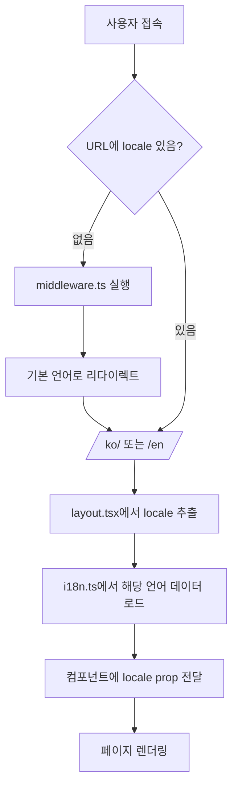

# 다국어(i18n) 시스템 완전 가이드

이 문서는 Next.js 포트폴리오 프로젝트의 다국어 시스템 구조와 작동 원리, 확장 방법을 자세히 설명합니다.

## 📋 목차

1. [시스템 개요](#시스템-개요)
2. [파일 구조](#파일-구조)
3. [middleware.ts 역할](#middlewarets-역할)
4. [i18n.ts 구조](#i18nts-구조)
5. [작동 원리](#작동-원리)
6. [컴포넌트에서 사용법](#컴포넌트에서-사용법)
7. [확장 방법](#확장-방법)
8. [실제 예시](#실제-예시)

---

## 🌍 시스템 개요

### 지원 언어
- **한국어 (ko)**: 기본 언어
- **영어 (en)**: 보조 언어

### URL 구조
```
/ko/          → 한국어 홈페이지
/en/          → 영어 홈페이지
/             → 자동으로 /ko/로 리다이렉트
```

### 핵심 특징
- **자동 리다이렉트**: 언어 없는 URL을 기본 언어로 리다이렉트
- **SEO 최적화**: 각 언어별 메타데이터 지원
- **타입 안전성**: TypeScript로 완전한 타입 체크
- **확장성**: 새로운 언어 쉽게 추가 가능

---

## 📁 파일 구조

```
src/
├── middleware.ts              # 🚦 URL 라우팅 및 언어 감지
├── lib/
│   └── i18n.ts               # 🌐 다국어 데이터 및 설정
├── app/
│   └── [locale]/             # 📁 동적 언어 라우팅
│       ├── layout.tsx        # 레이아웃 (메타데이터 포함)
│       └── page.tsx          # 메인 페이지
└── components/
    ├── Header.tsx            # 헤더 (언어 전환 버튼)
    ├── LanguageSwitcher.tsx  # 언어 전환 컴포넌트
    └── ...                   # 기타 컴포넌트들
```

---

## 🚦 middleware.ts 역할

### 📍 위치
`src/middleware.ts`

### 🎯 주요 기능

#### 1. **자동 언어 감지 및 리다이렉트**
```typescript
export function middleware(request: NextRequest) {
  const pathname = request.nextUrl.pathname
  
  // 이미 locale이 있는 경로인지 확인
  const pathnameIsMissingLocale = locales.every(
    (locale) => !pathname.startsWith(`/${locale}/`) && pathname !== `/${locale}`
  )

  // locale이 없으면 기본 locale로 리다이렉트
  if (pathnameIsMissingLocale) {
    return NextResponse.redirect(
      new URL(`/${defaultLocale}${pathname}`, request.url)
    )
  }
}
```

#### 2. **실행 조건 설정**
```typescript
export const config = {
  // API 경로, static 파일, favicon 등은 제외
  matcher: [
    '/((?!api|_next/static|_next/image|favicon.ico).*)',
  ],
}
```

### 🔄 작동 과정

1. **사용자 접속**: `https://example.com/` 접속
2. **미들웨어 실행**: URL에 언어 코드가 없음을 감지
3. **자동 리다이렉트**: `https://example.com/ko/`로 리다이렉트
4. **페이지 렌더링**: 한국어 버전 페이지 표시

### 🚫 제외 경로
- `/api/*` - API 라우트
- `/_next/static/*` - 정적 파일
- `/_next/image/*` - 이미지 최적화
- `/favicon.ico` - 파비콘

---

## 🌐 i18n.ts 구조

### 📍 위치
`src/lib/i18n.ts`

### 🏗️ 구조 분석

#### 1. **기본 설정**
```typescript
export const locales = ['ko', 'en'] as const
export type Locale = typeof locales[number]  // 'ko' | 'en'
export const defaultLocale: Locale = 'ko'
```

#### 2. **메타데이터 (SEO)**
```typescript
export const localeMetadata = {
  ko: {
    title: '포트폴리오 - 프론트엔드 개발자',
    description: '프론트엔드 개발자의 포트폴리오 사이트입니다...',
    lang: 'ko'
  },
  en: {
    title: 'Portfolio - Frontend Developer', 
    description: 'Frontend developer portfolio site...',
    lang: 'en'
  }
}
```

#### 3. **네비게이션 데이터**
```typescript
export const navigationData = {
  ko: {
    home: '홈',
    about: '소개',
    skills: '기술',
    // 메가메뉴 구조
    megaMenu: {
      about: {
        sections: [
          {
            title: '개발자 소개',
            items: [
              { name: '자기소개', id: 'about', description: '...' }
            ]
          }
        ]
      }
    }
  },
  en: { /* 영어 버전 */ }
}
```

#### 4. **공통 데이터 (언어 무관)**
```typescript
const commonSkillsData = {
  frontend: [
    { name: 'HTML5', logo: '/images/skills/html5.svg' },
    { name: 'CSS3', logo: '/images/skills/css3.svg' },
    'JavaScript',  // 로고 없는 경우
    // ...
  ],
  tools: [
    'Git', 'GitHub', 'VS Code'
    // ...
  ]
}
```

#### 5. **메인 콘텐츠 데이터**
```typescript
export const contentData = {
  ko: {
    hero: {
      greeting: '안녕하세요! 👋',
      name: '프론트엔드 개발자',
      subtitle: '사용자 경험을 중시하는 개발자입니다'
    },
    about: {
      title: '소개',
      subtitle: '저에 대해 알아보세요',
      questions: [
        {
          q: '어떤 개발자가 되고 싶나요?',
          a: '사용자 중심의 웹 서비스를 만드는 개발자가 되고 싶습니다.'
        }
      ]
    },
    skills: {
      title: 'Skills & Tools',
      subtitle: '기술 스택',
      description: '새로운 기술에 대한 호기심이 많고...',
      frontend: {
        title: 'Frontend',
        skills: commonSkillsData.frontend  // 공통 데이터 참조
      },
      tools: {
        title: 'Tools',
        items: commonSkillsData.tools      // 공통 데이터 참조
      }
    },
    // projects, career, education 등...
  },
  en: {
    // 영어 버전 데이터
  }
}
```

---

## ⚙️ 작동 원리

### 🔄 전체 플로우



### 📝 단계별 설명

#### 1단계: URL 접속
```
사용자가 https://example.com/ 접속
```

#### 2단계: 미들웨어 실행
```typescript
// middleware.ts에서 실행
if (pathnameIsMissingLocale) {
  return NextResponse.redirect(new URL(`/${defaultLocale}${pathname}`, request.url))
}
```

#### 3단계: 동적 라우팅
```typescript
// app/[locale]/layout.tsx
export default function RootLayout({
  children,
  params: { locale }
}: {
  children: React.ReactNode
  params: { locale: Locale }
}) {
  // locale = 'ko' 또는 'en'
}
```

#### 4단계: 데이터 로드
```typescript
// 컴포넌트에서
import { contentData } from '@/lib/i18n'

function MyComponent({ locale }: { locale: Locale }) {
  const data = contentData[locale]  // 해당 언어 데이터
  return <div>{data.hero.greeting}</div>
}
```

---

## 🧩 컴포넌트에서 사용법

### 기본 사용법

```typescript
// components/HeroSection.tsx
import { contentData, type Locale } from '@/lib/i18n'

interface HeroSectionProps {
  locale: Locale
}

export default function HeroSection({ locale }: HeroSectionProps) {
  const heroData = contentData[locale].hero
  
  return (
    <section>
      <h1>{heroData.greeting}</h1>
      <h2>{heroData.name}</h2>
      <p>{heroData.subtitle}</p>
    </section>
  )
}
```

### 네비게이션 사용법

```typescript
// components/Header.tsx
import { navigationData, type Locale } from '@/lib/i18n'

export default function Header({ locale }: { locale: Locale }) {
  const nav = navigationData[locale]
  
  return (
    <nav>
      <a href={`/${locale}/`}>{nav.home}</a>
      <a href={`/${locale}/#about`}>{nav.about}</a>
      <a href={`/${locale}/#skills`}>{nav.skills}</a>
    </nav>
  )
}
```

### 메타데이터 사용법

```typescript
// app/[locale]/layout.tsx
import { localeMetadata, type Locale } from '@/lib/i18n'

export async function generateMetadata({ 
  params: { locale } 
}: { 
  params: { locale: Locale } 
}) {
  const metadata = localeMetadata[locale]
  
  return {
    title: metadata.title,
    description: metadata.description,
    lang: metadata.lang
  }
}
```

---

## 🚀 확장 방법

### 1. 새로운 언어 추가

#### Step 1: 기본 설정 수정
```typescript
// lib/i18n.ts
export const locales = ['ko', 'en', 'ja'] as const  // 일본어 추가
export const defaultLocale: Locale = 'ko'
```

#### Step 2: 메타데이터 추가
```typescript
export const localeMetadata = {
  ko: { /* 기존 */ },
  en: { /* 기존 */ },
  ja: {  // 새로 추가
    title: 'ポートフォリオ - フロントエンド開発者',
    description: 'フロントエンド開発者のポートフォリオサイトです...',
    lang: 'ja'
  }
}
```

#### Step 3: 네비게이션 데이터 추가
```typescript
export const navigationData = {
  ko: { /* 기존 */ },
  en: { /* 기존 */ },
  ja: {  // 새로 추가
    home: 'ホーム',
    about: '紹介',
    skills: 'スキル',
    // ...
  }
}
```

#### Step 4: 콘텐츠 데이터 추가
```typescript
export const contentData = {
  ko: { /* 기존 */ },
  en: { /* 기존 */ },
  ja: {  // 새로 추가
    hero: {
      greeting: 'こんにちは！ 👋',
      name: 'フロントエンド開発者',
      subtitle: 'ユーザー体験を重視する開発者です'
    },
    // 모든 섹션 데이터 추가...
  }
}
```

### 2. 새로운 섹션 추가

#### Step 1: 타입 정의 (선택사항)
```typescript
// lib/i18n.ts에 추가
interface ContactSection {
  title: string
  subtitle: string
  email: string
  phone: string
  address: string
}
```

#### Step 2: 데이터 추가
```typescript
export const contentData = {
  ko: {
    // 기존 섹션들...
    contact: {  // 새로운 섹션
      title: '연락처',
      subtitle: '언제든 연락주세요',
      email: 'example@email.com',
      phone: '010-1234-5678',
      address: '서울시 강남구'
    }
  },
  en: {
    // 기존 섹션들...
    contact: {  // 새로운 섹션
      title: 'Contact',
      subtitle: 'Get in touch anytime',
      email: 'example@email.com',
      phone: '+82-10-1234-5678',
      address: 'Gangnam-gu, Seoul'
    }
  }
}
```

#### Step 3: 컴포넌트 생성
```typescript
// components/ContactSection.tsx
import { contentData, type Locale } from '@/lib/i18n'

interface ContactSectionProps {
  locale: Locale
}

export default function ContactSection({ locale }: ContactSectionProps) {
  const contactData = contentData[locale].contact
  
  return (
    <section>
      <h2>{contactData.title}</h2>
      <p>{contactData.subtitle}</p>
      <div>
        <p>Email: {contactData.email}</p>
        <p>Phone: {contactData.phone}</p>
        <p>Address: {contactData.address}</p>
      </div>
    </section>
  )
}
```

### 3. 공통 데이터 확장

#### 새로운 공통 데이터 추가
```typescript
// lib/i18n.ts
const commonProjectCategories = [
  'Frontend', 'Backend', 'Full Stack', 'Mobile'
]

const commonTechStack = {
  frontend: [
    { name: 'React', logo: '/images/skills/react.svg' },
    // ...
  ],
  backend: [  // 새로 추가
    { name: 'Node.js', logo: '/images/skills/nodejs.svg' },
    { name: 'Express', logo: '/images/skills/express.svg' },
    // ...
  ]
}

export const contentData = {
  ko: {
    skills: {
      frontend: {
        title: 'Frontend',
        skills: commonTechStack.frontend
      },
      backend: {  // 새로 추가
        title: 'Backend',
        skills: commonTechStack.backend
      }
    }
  }
}
```

### 4. 언어 전환 기능 확장

#### 고급 언어 전환 컴포넌트
```typescript
// components/AdvancedLanguageSwitcher.tsx
import { locales, type Locale } from '@/lib/i18n'
import { useRouter, usePathname } from 'next/navigation'

const languageNames = {
  ko: '한국어',
  en: 'English',
  ja: '日本語'
}

export default function AdvancedLanguageSwitcher({ 
  currentLocale 
}: { 
  currentLocale: Locale 
}) {
  const router = useRouter()
  const pathname = usePathname()
  
  const switchLanguage = (newLocale: Locale) => {
    // 현재 경로에서 언어만 변경
    const newPath = pathname.replace(`/${currentLocale}`, `/${newLocale}`)
    router.push(newPath)
  }
  
  return (
    <div className="language-switcher">
      {locales.map((locale) => (
        <button
          key={locale}
          onClick={() => switchLanguage(locale)}
          className={currentLocale === locale ? 'active' : ''}
        >
          {languageNames[locale]}
        </button>
      ))}
    </div>
  )
}
```

---

## 💡 실제 예시

### 예시 1: 프로젝트 카드 컴포넌트

```typescript
// components/ProjectCard.tsx
import { contentData, type Locale } from '@/lib/i18n'

interface ProjectCardProps {
  locale: Locale
  projectIndex: number
}

export default function ProjectCard({ locale, projectIndex }: ProjectCardProps) {
  const project = contentData[locale].projects.items[projectIndex]
  const viewDetailsText = contentData[locale].projects.viewDetails
  
  return (
    <div className="project-card">
      <h3>{project.title}</h3>
      <p>{project.description}</p>
      <div className="tech-stack">
        {project.techStack.map((tech, index) => (
          <span key={index}>{tech}</span>
        ))}
      </div>
      <button>{viewDetailsText}</button>
    </div>
  )
}
```

### 예시 2: 동적 메타데이터

```typescript
// app/[locale]/projects/[slug]/page.tsx
import { localeMetadata, contentData, type Locale } from '@/lib/i18n'

export async function generateMetadata({ 
  params: { locale, slug } 
}: { 
  params: { locale: Locale, slug: string } 
}) {
  const project = contentData[locale].projects.items.find(
    p => p.slug === slug
  )
  
  return {
    title: `${project?.title} - ${localeMetadata[locale].title}`,
    description: project?.description,
    lang: localeMetadata[locale].lang
  }
}
```

### 예시 3: 조건부 렌더링

```typescript
// components/AboutSection.tsx
import { contentData, type Locale } from '@/lib/i18n'

export default function AboutSection({ locale }: { locale: Locale }) {
  const aboutData = contentData[locale].about
  
  return (
    <section>
      <h2>{aboutData.title}</h2>
      <p>{aboutData.subtitle}</p>
      
      {/* 한국어일 때만 특별한 메시지 표시 */}
      {locale === 'ko' && (
        <div className="korean-special">
          <p>한국어 사용자를 위한 특별한 메시지입니다!</p>
        </div>
      )}
      
      {/* Q&A 섹션 */}
      <div className="qa-section">
        {aboutData.questions.map((qa, index) => (
          <div key={index}>
            <h4>{qa.q}</h4>
            <p>{qa.a}</p>
          </div>
        ))}
      </div>
    </section>
  )
}
```

---

## 🔧 디버깅 및 문제 해결

### 자주 발생하는 문제들

#### 1. 무한 리다이렉트
**원인**: layout.tsx에서 redirect() 사용
**해결**: middleware.ts에서만 리다이렉트 처리

#### 2. 타입 오류
**원인**: contentData 구조 불일치
**해결**: 모든 언어에서 동일한 구조 유지

#### 3. 이미지 로드 실패
**원인**: 공통 데이터 파일 경로 오류
**해결**: public 폴더 구조 확인

### 디버깅 도구

```typescript
// 개발 모드에서 현재 언어 정보 확인
console.log('Current locale:', locale)
console.log('Available locales:', locales)
console.log('Content data:', contentData[locale])
```

---

## 📚 추가 리소스

### 관련 문서
- [Next.js Internationalization](https://nextjs.org/docs/app/building-your-application/routing/internationalization)
- [TypeScript Handbook](https://www.typescriptlang.org/docs/)

### 유용한 도구
- **i18n Ally**: VS Code 확장 프로그램
- **Google Translate**: 번역 도구
- **DeepL**: 고품질 번역 서비스

---

## 🎯 요약

이 다국어 시스템은 다음과 같은 특징을 가집니다:

✅ **자동 언어 감지**: middleware.ts가 URL 기반으로 언어 결정  
✅ **타입 안전성**: TypeScript로 완전한 타입 체크  
✅ **SEO 최적화**: 언어별 메타데이터 지원  
✅ **확장성**: 새로운 언어/섹션 쉽게 추가  
✅ **공통 데이터**: 언어와 무관한 데이터 효율적 관리  
✅ **개발자 친화적**: 명확한 구조와 디버깅 도구  

이 시스템을 통해 다국어 웹사이트를 효율적으로 관리하고 확장할 수 있습니다! 🚀